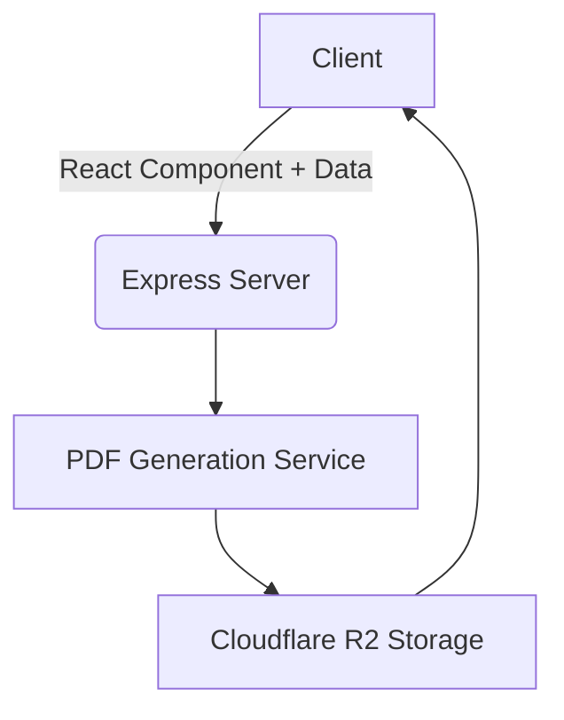

# BlitzPDF: PDF Generation API with Plain React and TailwindCSS

> `react-pdf` exists. Why should i use `BlitzPDF`?
> While `react-pdf` uses its own "dialect" of react by having purpose specific components like `<Page>`, etc, and doesn't have inbuilt support for tailwind, In most usecases, you'd just want to build PDFs with plain old react components and tailwind css. This is where BlitzPDF comes in.


[](https://opensource.org/licenses/MIT)

BlitzPDF is a groundbreaking PDF generation service that harnesses the power of React and Tailwind CSS to create customizable PDFs on-the-fly. This innovative approach offers unparalleled flexibility for developers integrating PDF generation capabilities into their applications.

## 🚀 Key Features

- **React-Powered PDF Generation**: Utilize standard React components to design your PDFs without syntax convolution.
- **Tailwind CSS Integration**: Leverage Tailwind CSS for rapid, consistent styling across your PDFs.
- **Real-Time Preview**: Instant PDF previews as you edit your React components and data.
- **Multi-Language API Support**: Generate API requests in JavaScript, Python, Java, and cURL with a single click.
- **Cloudflare R2 Integration**: Efficient storage and retrieval of generated PDFs.

## 🛠 Technical Stack

- **Frontend**: Next.js, React, Tailwind CSS
- **Backend**: Node.js, Express
- **PDF Generation**: Puppeteer
- **Code Editing**: Monaco Editor
- **State Management**: React Hooks
- **API Integration**: Axios
- **Cloud Storage**: Cloudflare R2

## 🏗 Current Architecture

BlitzPDF currently operates as a monolithic application:



## 🚀 Quick Start

1. Clone the repository:
   ```bash
   git clone https://github.com/yourusername/blitzpdf.git
   ```

2. Install dependencies:
   ```bash
   pnpm install
   ```

3. Start the development server:
   ```bash
   pnpm run dev
   ```

4. Visit `http://localhost:3000` to start creating PDFs!

## 🖥 Live Demo

Experience BlitzPDF in action: [BlitzPDF Demo](https://blitzpdf.blitzdnd.com)

BlitzPDF SwaggerUI (Intentionally made available in prod): [BlitzPDF Swagger](https://api-blitzpdf.blitzdnd.com/api-docs)

## 🛡 Security

While formal security audits have not yet been conducted, BlitzPDF implements the following security measures:

- User-provided React components are executed in a controlled environment.
- Basic input validation is performed to mitigate common security risks.

Enhancing security measures is a key priority for future development.

## 🌐 API Reference

API documentation is available via Swagger UI at `http://localhost:5000/api-docs` when running the server locally.

## 🔮 Future Scope

We have exciting plans for the future of BlitzPDF:

1. **Containerization**: Implement Docker for easier deployment and scaling.
2. **Microservices Architecture**: Transition from monolithic to microservices architecture for improved scalability and maintainability.
3. **Serverless Deployment**: Adapt the application for serverless environments to enhance scalability and cost-efficiency.
4. **Performance Optimization**: Implement caching, parallel processing, and other optimizations to improve PDF generation speed and overall system performance.
5. **Cloud-Native Architecture**: Redesign the application to fully leverage cloud services for improved resilience and scalability.
6. **Comprehensive Security Audit**: Conduct thorough security assessments and implement advanced security measures.
7. **Expanded API Documentation**: Develop comprehensive, interactive API documentation.

## 🤝 Contributing

We welcome contributions! Please see our [Contributing Guide](CONTRIBUTING.md) for more details.

## 📜 License

BlitzPDF is MIT licensed. See [LICENSE](LICENSE) for more information.

## 📬 Contact

For support or inquiries, please contact us at contact@blitzdnd.com

---

Built with ❤️ by BlitzJB
